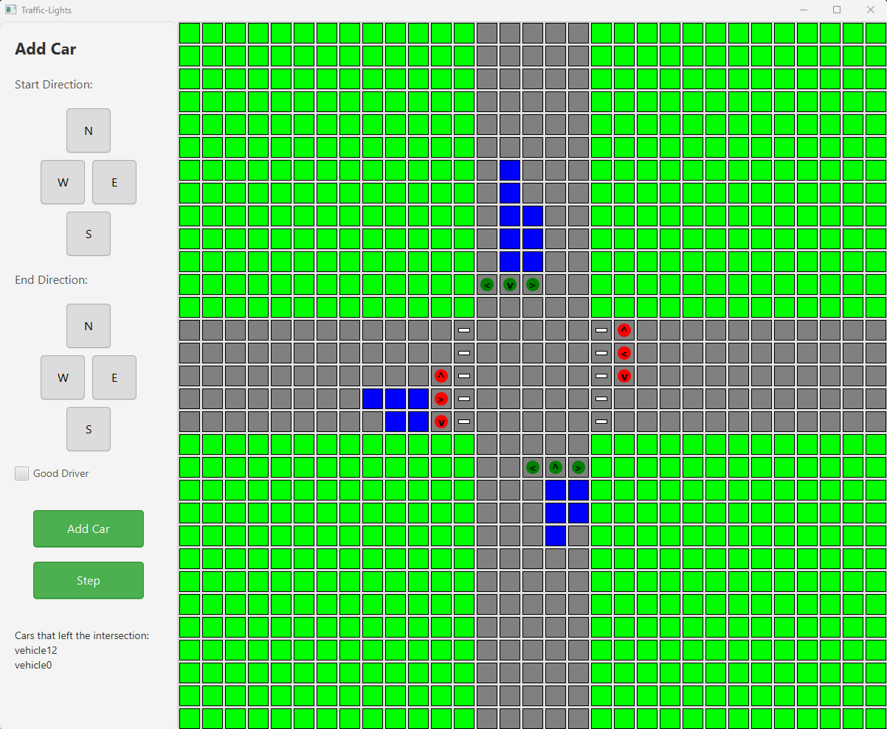

# Traffic Lights

## Author
- **[Filip Mokrzycki](https://github.com/Filipmok-agh)** 

## Description
This project creates an application that simulates an intersection with traffic lights and models how cars move through it. It visualizes the simulation and allows manual control when "manualSimulation" is selected. Users can also provide a JSON file with commands, and the application generates a JSON output file with the steps showing how cars left the intersection.

## Technologies and Tools  
- **Programming Language**: Java 21  
- **Build Tool**: Gradle  
- **Libraries**: JavaFX  
- **Testing**: JUnit

## Running the Application
To run the application and tests in Docker, follow these steps:
1. **Clone the repository**:
   ```bash
   git clone https://github.com/Filipmok-agh/Traffic-lights.git
   ```
2. **Navigate to the project directory**:
   ```bash
   cd Traffic-lights/Traffic-lights
   ```
3. **Run the application**:
   ```bash
   ./gradlew.bat run
   ```
### Features:
- Advanced traffic light system
- Proper dependencies between traffic lanes
- Option for "goodDriver" to allow passing through yellow lights
- Pedestrian crossings appearing randomly and blocking some lanes during the simulation

#### 1. **Starting Screen**:
- Allows the user to choose the simulation variant and enter the output JSON file name (if "jsonSimulation" is chosen)


#### 2. **Manual Simulation**:
- Allows the user to add cars to specific lanes
- User can decide if the driver is good
- Allows control of the simulation by clicking the "step" button


#### 3. **JSON Simulation**:
- Allows the user to upload a JSON file
- The JSON file is analyzed for correctness
- User can select the name of the saved file in the "resources" package
- Starts the simulation when the "start" button is clicked


## Input
### Inputs are accepted in the following format:

```json
{
  "commands": [
    {
      "type": "addVehicle",
      "vehicleId": "vehicle1",
      "startRoad": "north",
      "endRoad": "south",
      "goodDriver": "true"
    },
    {
      "type": "step"
    },
    {
      "type": "step"
    },
    {
      "type": "addVehicle",
      "vehicleId": "vehicle24",
      "startRoad": "north",
      "endRoad": "west",
      "goodDriver": "true"
    }
  ]
}

```

## Output
### Output will have the following format:
```json
{
  "stepStatuses": [
    {
      "leftVehicles": [
        "vehicle3"
      ]
    },
    {
      "leftVehicles": []
    },
    {
      "leftVehicles": [
        "vehicle5"
      ]
    }
  ]
}
```

## Additional Information:
- A sample test file, **Example.json**, is included to demonstrate the simulation with predefined commands.
- The project has been thoroughly tested using extensive unit tests to ensure its functionality and reliability.

### Road <br>


### GrassField <br>


### Car <br>


### Crosswalk <br>


### Light <br>

